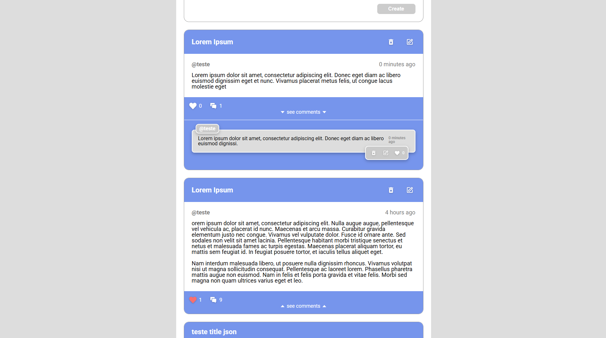

# Codeleap Project

## Introduction

The **Codeleap Project** is an application originally developed as a front-end challenge. Its primary goal is to demonstrate skills in React, state management, styling, and best practices with TypeScript. The project leverages modern technologies to provide an efficient and responsive user experience.

This project has evolved into two distinct versions:

- **Branch: Main**: Focused on the initial features and basic implementation for quick project delivery.
- **Branch: Main-2**: Introduces more functionalities, animations, and integration with an external API.

> ⚠️ **Attention:** In **Branch: Main-2**, the API used is free and automatically deactivates after 15 minutes of inactivity. Therefore, when attempting to use it, there might be a slight initial delay while the API is reactivated.

---

## Features

### Branch: Main

- **Posts:**
  - **View all posts:** Displays a list of posts created by users.
  - **Create a post:** Allows users to create posts with a title and content.
  - **Edit a post (modal):** Updates the title or content of an existing post.
  - **Delete a post (modal):** Removes a selected post after confirmation.
- **Homepage**: Displays all posts and provides options to create, edit, and delete posts.

> **Brief image of how it looks:** > 

### Branch: Main-2

- **Enhanced Features:**
  - Integration with an external API provided by [IanBraga96](https://github.com/IanBraga96).
  - Improved state management and data handling through API and new implementations.
- **Animations:**
  - Added interactive animations to enhance the user experience.
- **Additional Features:**

  - More responsive design for different types of devices.

- **Posts:**
  - **Post likes:** Displays likes and whether the post was liked by the user.
  - **Post comments:** Displays a list of comments created by users on posts.
- **Comments:**
  - **Create a comment:** Allows users to write simple comments.
    - **Mentions:** Users can mention others involved in the conversation; when typing `@`, a list is displayed.
  - **Comment listing:** Displays all comments on the post.
  - **Edit or delete comments:** Users who made the comment can edit or delete it.
  - **Comment likes:** Users can like comments made by others.
- **Authentication:**

  - **Sign-in:** Now includes authentication with email and password.
  - **Sign-up:** The initial modal switches to a user registration modal.

> **Brief image of how it looks:** > 

---

## Installation and Execution

To run the project locally, follow these steps:

### Clone the repository:

```bash
git clone git@github.com:breno-aredes/codeleap-project.git
```

### Navigate to the project directory:

```bash
cd codeleap-project
```

### Install the dependencies:

```bash
npm install
```

### Start the development server:

```bash
npm run dev
```

To switch between branches:

```bash
git switch main-2
```

---

## Technologies Used

### Common in Both Branches

- **[React](https://reactjs.org/):** Library for building user interfaces.
- **[React Hook Form](https://react-hook-form.com/):** Library for form management.
- **[Yup](https://github.com/jquense/yup):** Library for form validation.
- **[Styled Components](https://styled-components.com/):** Library for styling components.
- **[React Icons](https://react-icons.github.io/react-icons/):** Icon library for React.
- **[React Toastify](https://fkhadra.github.io/react-toastify/):** Library for notifications.
- **[TanStack React Query](https://tanstack.com/query/latest):** Asynchronous state management and data caching.
- **[TypeScript](https://www.typescriptlang.org/):** JavaScript superset that adds static typing.
- **[Vite](https://vitejs.dev/):** Fast and configurable build tool.

---

## Available Scripts

- `npm run dev`: Starts the development server.
- `npm run build`: Builds the project for production.
- `npm run preview`: Previews the production build locally.

---

## Deployment Links

### Branch: Main

The original project is available online and can be accessed at the following link:
[Deploy Main](https://codeleap-project.vercel.app/)

### Branch: Main-2

The enhanced version with additional features and API integration is available at:
[Deploy Main-2](https://codeleap-project2.vercel.app/)
