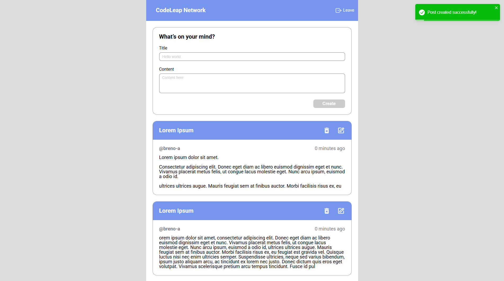

# Codeleap Project

## Introdução

O **Codeleap Project** é uma aplicação desenvolvida como desafio de front-end. O objetivo principal é demonstrar habilidades em React, gerenciamento de estado, estilização e boas práticas com TypeScript. Este projeto segue uma abordagem moderna com tecnologias de ponta para criar uma experiência de usuário eficiente e responsiva.

## Funcionalidades

- **Postagens**:

  - Visualizar todas as postagens:
  - Exibe uma lista de postagens criadas por usuários.
  - Criar uma postagem:
    - Permite a criação de postagens com título e conteúdo.
  - Editar uma postagem (modal):
    - Atualiza o título ou conteúdo de uma postagem existente.
  - Excluir uma postagem (modal):
    - Remove uma postagem selecionada após confirmação.

  

## Instalação e Execução

1. Clone o repositório:

```sh
git clone git@github.com:breno-aredes/codeleap-project.git
```

2. Acesse o diretório do projeto:

```sh
cd codeleap-project
```

3. Instale as dependências:

```sh
npm install
```

4. Inicie o servidor de desenvolvimento:

```sh
npm run dev
```

## Tecnologias Utilizadas

- **React:** Biblioteca para construção da interface do usuário.
- **React Hook Form:** Biblioteca para gerenciamento de formulários.
- **Yup:** Biblioteca para validação de formulários.
- **Styled Components:** Biblioteca para estilização de componentes.
- **React Icons:** Biblioteca de ícones para React.
- **React Toastify:** Biblioteca para notificações.
- **TanStack React Query:** Gerenciamento de estado assíncrono e cache de dados.
- **TypeScript:** Superset do JavaScript que adiciona tipagem estática.
- **Vite:** Ferramenta de build rápida e configurável.

## Scripts Disponíveis

- `npm run dev`: Inicia o servidor de desenvolvimento.
- `npm run build`: Faz o build do projeto para produção.
- `npm run preview`: Visualiza o build de produção localmente.

## Link do Deploy

O projeto está disponível online e pode ser acessado através do seguinte link:
[Deploy do Projeto](https://codeleap-project.vercel.app/)

---
